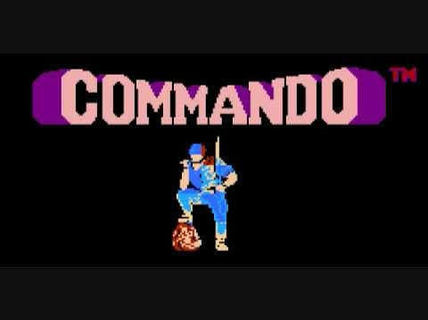

# Commando 1985 Video Game Screen Saver for Apple Mac Book
Commando 1985 as a vertically scrolling run and gun shooter developed by CapCom. This is a screen saver for Command 1985 video game players




# CommandoScreenSaver

A macOS `.saver` screen saver project written in Swift with
`ScreenSaver.framework`.

All current graphics are generated programmatically in Swift. No external sprite sheets, images, audio
files, or original game assets are required.

------------------------------------------------------------------------

# Project Contents

The project contains:

``` text
CommandoScreenSaver_COMPLETE/
├── CommandoScreenSaver.xcodeproj
├── CommandoScreenSaver/
│   ├── CommandoScreenSaverView.swift
│   ├── GameScene.swift
│   ├── Player.swift
│   ├── Enemy.swift
│   ├── Projectile.swift
│   ├── Explosion.swift
│   ├── Terrain.swift
│   ├── Pixel.swift
│   └── Info.plist
└── README.md
```

The Xcode target builds:

``` text
CommandoScreenSaver.saver
```

This `.saver` bundle is the installable macOS screen saver.

------------------------------------------------------------------------

#  Requirements

Recommended development environment:

-   macOS
-   Xcode
-   Swift 5
-   macOS deployment target 13.0 or later
-   `ScreenSaver.framework`
-   Apple Development signing identity for local development if Xcode
    requests signing

For local testing on your own Mac, a paid Developer ID distribution
certificate is not required.

For public distribution outside your own Mac, Developer ID signing and
Apple notarization should be used.

------------------------------------------------------------------------

# Open the Project

1.  Unzip the project.
2.  Open the resulting folder in Finder.
3.  Double-click:

``` text
CommandoScreenSaver.xcodeproj
```

4.  Wait for Xcode to finish loading and indexing.
5.  Confirm the scheme at the top of Xcode is:

``` text
CommandoScreenSaver
```

Do not open an individual `.swift` file instead of the `.xcodeproj`.

------------------------------------------------------------------------

# Verify the Target

In Xcode:

1.  Select the blue project icon in the Project Navigator.
2.  Under **TARGETS**, select:

``` text
CommandoScreenSaver
```

3.  Open **General** and **Build Settings** as needed.

The product must be a bundle whose extension is:

``` text
.saver
```

The expected final product name is:

``` text
CommandoScreenSaver.saver
```

------------------------------------------------------------------------


------------------------------------------------------------------------

# Required Build Settings

Select:

``` text
TARGETS
→ CommandoScreenSaver
→ Build Settings
```

Verify the important settings.

## Wrapper Extension

Search for:

``` text
Wrapper Extension
```

It should be:

``` text
saver
```

This causes Xcode to produce:

``` text
CommandoScreenSaver.saver
```

instead of a normal `.bundle`.

## Mach-O Type

The target uses:

``` text
mh_bundle
```

## Product Bundle Package Type

The bundle package type is:

``` text
BNDL
```

## Info.plist

The project uses:

``` text
CommandoScreenSaver/Info.plist
```

`Generate Info.plist File` should be disabled because the project
supplies its own plist.

## Deployment Target

The supplied project is configured for:

``` text
macOS 13.0
```

Do not increase this unless you intentionally want to prevent
installation on older supported Macs.

------------------------------------------------------------------------

# ScreenSaver.framework

The target must link Apple's:

``` text
ScreenSaver.framework
```

Verify this under:

``` text
TARGETS
→ CommandoScreenSaver
→ Build Phases
→ Link Binary With Libraries
```

You should see:

``` text
ScreenSaver.framework
```

The main view imports it with:

``` swift
import ScreenSaver
```

------------------------------------------------------------------------

# Principal Screen Saver Class

The screen saver entry point is:

``` text
CommandoScreenSaverView
```

The class is declared in:

``` text
CommandoScreenSaverView.swift
```

The `Info.plist` contains:

``` xml
<key>NSPrincipalClass</key>
<string>CommandoScreenSaver.CommandoScreenSaverView</string>
```

This tells macOS which `ScreenSaverView` subclass to instantiate.

If this value is incorrect, the `.saver` can build successfully but fail
to load in System Settings.

------------------------------------------------------------------------

# Source File Responsibilities

## CommandoScreenSaverView.swift

This is the Apple macOS screen saver entry point.

It:

-   subclasses `ScreenSaverView`
-   establishes the animation interval
-   creates the game scene
-   advances the animation
-   requests redraws
-   draws the scene into the screen saver view
-   reports that no configuration sheet is currently provided

The target animation interval is approximately:

``` text
60 frames per second
```

## GameScene.swift

This is the main simulation controller.

It manages:

-   player movement
-   enemy spawning
-   enemy movement
-   automatic player gunfire
-   enemy gunfire
-   grenades
-   projectile movement
-   collisions
-   explosions
-   score
-   terrain scrolling
-   drawing order
-   HUD rendering

The scene is autonomous. Keyboard or mouse input is not required.

## Player.swift

Draws and positions the player soldier.

The current character is procedural pixel-style artwork constructed with
rectangles.

## Enemy.swift

Defines enemy soldiers.

Each enemy has:

-   a position
-   movement phase
-   randomized movement speed
-   player tracking behavior
-   procedural drawing

The file includes an explicit:

``` swift
init(position: CGPoint)
```

This is required because the enemy also contains private stored
properties.

## Projectile.swift

Defines:

``` text
playerBullet
enemyBullet
grenade
```

It handles projectile position, velocity, age, movement, grenade
gravity, and drawing.

## Explosion.swift

Controls explosion lifetime, expansion, transparency, and drawing.

## Terrain.swift

Creates and scrolls environmental features such as:

-   trees
-   bushes
-   sandbags
-   rocks
-   water
-   dirt battlefield areas

Terrain is generated procedurally.

## Pixel.swift

Contains the low-level rectangle drawing helper used by the procedural
pixel-art graphics.

------------------------------------------------------------------------

# Resources and Resource Tags

The current project does **not** require external resources.

Therefore:

``` text
Build Phases
→ Copy Bundle Resources
```

may be empty.

Do not add Swift source files to **Copy Bundle Resources**.

The Swift files belong in:

``` text
Compile Sources
```

No resource tags are required for the current version.

Resource tags only become relevant if the project later includes actual
bundled resources such as:

-   PNG images
-   sprite sheets
-   sound effects
-   music
-   JSON configuration
-   fonts
-   texture atlases
-   other data files

If assets are added later, add the required files to the target and
verify that they appear in **Copy Bundle Resources**.

------------------------------------------------------------------------

# Build the Screen Saver

For a normal development build:

``` text
Product
→ Build
```

Keyboard shortcut:

``` text
Command-B
```

Wait for:

``` text
Build Succeeded
```

If the build fails, open Xcode's Issue Navigator and fix all red
compiler errors before attempting installation.

------------------------------------------------------------------------


# Locate CommandoScreenSaver.saver

After a successful build, look in Xcode's Project Navigator for:

``` text
Products
```

Expand it.

You should see:

``` text
CommandoScreenSaver.saver
```

Right-click it and choose:

``` text
Show in Finder
```

This is the actual compiled screen saver bundle.

Do not distribute the `.xcodeproj` when your goal is simply to install
the finished screen saver.

The installable product is the `.saver`.

------------------------------------------------------------------------

#  Install on the Development Mac


``` text
CommandoScreenSaver.saver
```


macOS should present the screen saver installation interface.

Complete the installation.

Then open:

``` text
System Settings
→ Screen Saver
```

Find:

``` text
CommandoScreenSaver
```

and select it.

Test the preview before relying on automatic screen saver activation.

------------------------------------------------------------------------

# Manual Installation

If double-click installation is not appropriate, a user-level screen
saver can be placed in:

``` text
~/Library/Screen Savers/
```

The result should be:

``` text
~/Library/Screen Savers/CommandoScreenSaver.saver
```

`~` means the current user's home directory.

User-level installation is normally preferable during development.

A system-wide installation location also exists:

``` text
/Library/Screen Savers/
```

System-wide installation can require administrator privileges.

------------------------------------------------------------------------


# Clean Build

If Xcode appears to use stale build products:

``` text
Product
→ Clean Build Folder
```

Then build again.

The menu item may require holding the Option key depending on the Xcode
version.

A normal rebuild is:

``` text
Command-B
```

------------------------------------------------------------------------

# Common Error: Project Will Not Open

If Xcode reports:

``` text
Failed to load project ... for an unknown reason
```

the `.xcodeproj/project.pbxproj` structure is damaged or malformed.

Use the regenerated complete project rather than attempting to repair
the earlier malformed project manually.

The current project was regenerated with a complete Xcode project
structure.

------------------------------------------------------------------------

# Common Error: Enemy Initializer Is Inaccessible

An earlier project version could report:

``` text
'Enemy' initializer is inaccessible due to 'private' protection level
```

The corrected `Enemy.swift` explicitly defines:

``` swift
init(position: CGPoint) {
    self.position = position
    self.phase = Double.random(in: 0...(Double.pi * 2.0))
    self.speed = CGFloat.random(in: 58...92)
}
```

The complete regenerated project already contains this correction.

------------------------------------------------------------------------

# Common Error: Screen Saver Builds but Does Not Load

Check these items in order.

First, verify the product is actually:

``` text
CommandoScreenSaver.saver
```

not:

``` text
CommandoScreenSaver.bundle
```

Then verify:

``` text
Wrapper Extension = saver
```

Verify `ScreenSaver.framework` is linked.

Verify `Info.plist` contains:

``` xml
<key>NSPrincipalClass</key>
<string>CommandoScreenSaver.CommandoScreenSaverView</string>
```

Verify the compiled Swift module is:

``` text
CommandoScreenSaver
```

Finally, remove any old installed version and reinstall the newly built
`.saver`.

------------------------------------------------------------------------


# Common Error: Missing ScreenSaver.framework

If Xcode cannot resolve `ScreenSaverView` or reports:

``` text
No such module 'ScreenSaver'
```

verify the target is a macOS target and confirm:

``` text
ScreenSaver.framework
```

is present under:

``` text
Build Phases
→ Link Binary With Libraries
```

Also verify the source contains:

``` swift
import ScreenSaver
```

------------------------------------------------------------------------

# Copy Bundle Resources

For this version, the expected state is effectively:

``` text
Copy Bundle Resources
    (empty)
```

That is intentional.

The project does not currently rely on image files or other external
media.

Do not add files simply to make this section non-empty.

------------------------------------------------------------------------

# Compile Sources

Under:

``` text
Build Phases
→ Compile Sources
```

the Swift implementation files should be included:

``` text
CommandoScreenSaverView.swift
GameScene.swift
Player.swift
Enemy.swift
Projectile.swift
Explosion.swift
Terrain.swift
Pixel.swift
```

If one is missing, add it to the target's Compile Sources phase.

------------------------------------------------------------------------


# 26. Packaging 

For informal transfer to another Mac, the `.saver` can be placed in a
ZIP archive.

Example:

``` text
CommandoScreenSaver.zip
└── CommandoScreenSaver.saver
```

The receiving user extracts the ZIP and installs the `.saver`.

macOS security behavior depends on how the bundle is signed and
distributed.

For proper public distribution, use Developer ID signing and
notarization.

------------------------------------------------------------------------

# Developer ID Distribution

For distribution outside the Mac App Store, the normal Apple
distribution path is:

``` text
Release build
→ Developer ID signing
→ notarization
→ stapling
→ ZIP or DMG
```

This is different from ordinary Apple Development signing.

A public distribution build normally uses an appropriate Developer ID
certificate associated with an Apple Developer account.

Do not confuse:

``` text
Apple Development
```

with:

``` text
Developer ID
```

Development signing is for development/testing.

Developer ID signing is used for distributing software directly to users
outside the Mac App Store.

------------------------------------------------------------------------


# Recommended Packaging Sequence

Order

``` text
1. Build Debug
2. Fix compiler errors
3. Install locally
4. Test Screen Saver preview
5. Test full-screen activation
6. Fix runtime issues
7. Build Release
8. Test Release build locally
9. Configure Developer ID signing
10. Notarize
11. Staple notarization result
12. Package .saver in ZIP or DMG
13. Test package on another Mac
```


------------------------------------------------------------------------

# Runtime Behavior

The screen saver currently runs automatically.

The player:

-   moves across the lower portion of the battlefield
-   automatically fires
-   periodically throws grenades

Enemies:

-   enter from the top
-   move down the battlefield
-   partially track the player
-   automatically fire at the player

The battlefield:

-   continuously scrolls
-   generates terrain features procedurally

No user controls are required.

------------------------------------------------------------------------

# Graphics

The current graphics are intentionally generated by code.

This means the screen saver does not depend on:

``` text
Assets.xcassets
PNG sprite files
JPEG files
external texture atlases
```

The benefit is that the `.saver` remains self-contained and avoids
missing-resource packaging problems.

------------------------------------------------------------------------

# Adding Images Later

If sprite images are added later:

1.  Add them to the Xcode project.
2.  Enable target membership for `CommandoScreenSaver`.
3.  Check:

``` text
Build Phases
→ Copy Bundle Resources
```

4.  Confirm each required image appears there.
5.  Load images from the screen saver bundle rather than assuming a
    development-directory path.

Do not use absolute paths such as:

``` text
/Users/yourname/Desktop/...
```

inside the finished screen saver.

------------------------------------------------------------------------

# Version Numbers

The initial project uses:

``` text
Marketing Version: 1.0
Build: 1
```

For subsequent releases, increment the build number.

Example:

``` text
1.0 build 1
1.0 build 2
1.0 build 3
```

For a larger release:

``` text
1.1 build 4
```

Keep the bundle identifier stable once the project is being distributed.

------------------------------------------------------------------------

# Final Pre-Packaging Checklist

Before creating the final ZIP or DMG, verify:

-   Xcode opens the project without errors.
-   The `CommandoScreenSaver` scheme exists.
-   `Command-B` reports Build Succeeded.
-   The output extension is `.saver`.
-   `ScreenSaver.framework` is linked.
-   `Info.plist` is included.
-   `NSPrincipalClass` is correct.
-   All eight Swift source files compile.
-   No required files are missing from target membership.
-   Copy Bundle Resources is empty unless external assets have been
    added.
-   The `.saver` installs.
-   It appears in System Settings.
-   Preview works.
-   Full-screen screen saver activation works.
-   The Release build has also been tested.
-   Old installed development versions have been removed before final
    testing.
-   Signing is configured for the intended distribution method.
-   Public distribution builds are notarized.

------------------------------------------------------------------------

# Current Source List

The complete current source set is:

``` text
CommandoScreenSaverView.swift
GameScene.swift
Player.swift
Enemy.swift
Projectile.swift
Explosion.swift
Terrain.swift
Pixel.swift
Info.plist
```

Do not delete one of these files unless the corresponding functionality
has deliberately been moved elsewhere.

------------------------------------------------------------------------

#  Build Output

The final development artifact you are looking for is:

``` text
CommandoScreenSaver.saver
```

That bundle---not the `.xcodeproj`---is the actual screen saver.

The `.xcodeproj` is the development project used to create it.
````
